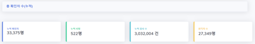
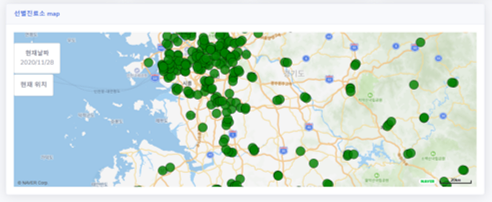

# Covid-19 information

코로나 확진자 정보와 선별진료소 위치를 보임





# 프로젝트 내용

[covid 공식 홈페이지](http://ncov.mohw.go.kr/)에서 에서 확진자 정보를 받아와 네이버api를 이용하여 지도상에 정보를 보여줌

# 사용방법

* node, nodemon 설치
```
nodemon ./myfirstmap/bin/www
```
* localhost:3000 접속

# 팀원

* 2016722068 안유성
* 2017203084 이주연
* 2019203004 박영서


